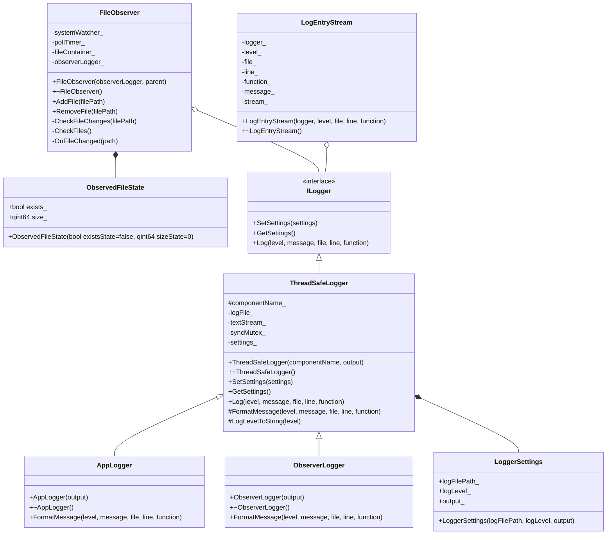

# Лабораторная работа по предмету: "Технологии программирования"
## Тема: "Наблюдение за файлами"
> 4 курс 2 семестр \
> Студент группы 932223 - Артеменко Антон Дмитриевич \

## Постановка задачи
Необходимо разработать консольное приложение для наблюдения за выбранными файлами.

В рамках лабораторной работы отслеживаются две характеристики файла:
- факт существования;
- размер.

Программа должна выводить уведомления при изменении состояния файла.

Поддерживаются следующие сценарии:
1. Файл существует и не пустой: выводится сообщение о существовании файла и его текущий размер.
2. Файл существует и был изменен: выводится сообщение об изменении и новый размер файла.
3. Файл отсутствует: выводится сообщение об отсутствии файла.

Обработка изменений выполняется через механизм сигналов и слотов Qt.

## Зависимости
Для сборки и запуска нужны:
- **Qt** v5 с модулем `Core`
- **CMake** v3.16+

## Архитектура решения
Приложение реализовано как консольная программа на базе `QCoreApplication`.

Основные компоненты решения:
- **FileObserver** — класс, отвечающий за наблюдение за файлами. Хранит текущее состояние каждого отслеживаемого файла, проверяет факт существования и размер.
- **QFileSystemWatcher** — используется для получения событий изменения файловой системы.
- **QTimer** — выполняет периодическую проверку файлов, чтобы фиксировать удаление, повторное появление файла и изменение размера.
- **ILogger / AppLogger / ObserverLogger** — подсистема логирования для вывода сообщений приложения и событий наблюдения в консоль или файл.

### UML-диаграмма классов



## Инструкция для пользователя
Сборка и запуск зависят от операционной системы.

<details>
<summary>Windows</summary>

Создайте директорию `build` и перейдите в нее:
```powershell
mkdir build
cd build
```

> Примечание: если переменная `PATH` не настроена, используйте полные пути к `cmake` и `windeployqt`.

Сконфигурируйте и соберите проект:
```powershell
cmake .. && cmake --build .
```

При необходимости разверните Qt-зависимости рядом с `.exe`:

```powershell
<path>\windeployqt .\file_observer_project.exe
```

Запустите программу:
```powershell
.\file_observer_project.exe
```

</details>

<details>
<summary>Linux / macOS</summary>

Создайте директорию `build` и перейдите в нее:
```bash
mkdir -p build && cd build
```

Сконфигурируйте и соберите проект:
```bash
cmake ..
cmake --build .
```

Запустите программу:
```bash
./file_observer_project
```

</details>

После запуска программа предложит ввести пути к файлам для наблюдения. Ввод завершается пустой строкой.

Доступные команды интерактивной консоли:
- `add <path>` — добавить файл в список наблюдения;
- `remove <path>` — удалить файл из списка наблюдения;
- `list` — вывести список наблюдаемых файлов;
- `help` — показать список команд;
- `quit` — завершить работу программы.

## Тестирование
Для проверки работы приложения используйте следующие сценарии:

- **Сценарий 1:** Запуск программы и добавление существующего непустого файла. Ожидается вывод сообщения о существовании файла и его размере.
- **Сценарий 2:** Изменение содержимого наблюдаемого файла во время работы. Ожидается сообщение об изменении и новый размер файла.
- **Сценарий 3:** Удаление наблюдаемого файла. Ожидается сообщение о том, что файл не существует.
- **Сценарий 4:** Повторное создание ранее удаленного файла по тому же пути. Ожидается сообщение о появлении файла и его текущем размере.
- **Сценарий 5:** Добавление пустого файла. Ожидается сообщение о существовании пустого файла.
- **Сценарий 6:** Запуск программы без добавления файлов на старте. Ожидается сообщение о том, что пока не добавлен ни один файл.
- **Сценарий 7:** Добавление файла командой `add <path>` во время работы. Ожидается включение файла в мониторинг и вывод его состояния.
- **Сценарий 8:** Удаление файла из мониторинга командой `remove <path>`. Ожидается прекращение уведомлений по этому файлу.
- **Сценарий 9:** Ввод неизвестной команды. Ожидается сообщение об ошибке и подсказка использовать `help`.
- **Сценарий 10:** Запуск приложения с дополнительными параметрами. Ожидается, что приложение продолжает работать с выводом логов только в консоль.