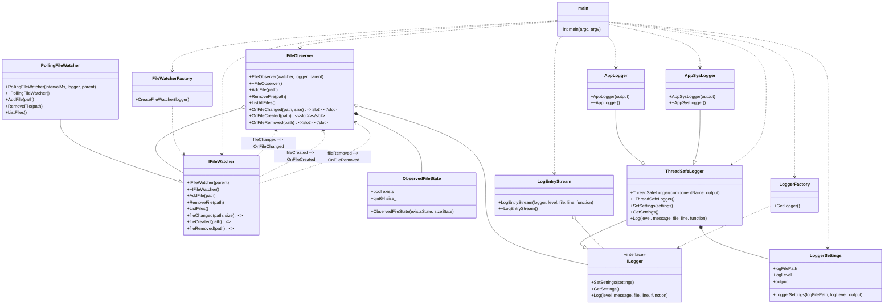

# Лабораторная работа по предмету: "Технологии программирования"
## Тема: "Наблюдение за файлами"
> 4 курс 2 семестр \
> Студент группы 932223 - Артеменко Антон Дмитриевич \

## Постановка задачи
Необходимо разработать консольное приложение для наблюдения за выбранными файлами.

В рамках лабораторной работы отслеживаются две характеристики файла:
- факт существования;
- размер.

Программа должна выводить уведомления при изменении состояния файла.

Поддерживаются следующие сценарии:
1. Файл существует и не пустой: выводится сообщение о существовании файла и его текущий размер.
2. Файл существует и был изменен: выводится сообщение об изменении и новый размер файла.
3. Файл отсутствует: выводится сообщение об отсутствии файла.

Обработка изменений выполняется через механизм сигналов и слотов Qt.

## Зависимости
Для сборки и запуска нужны:
- **Qt** v5 с модулем `Core`
- **CMake** v3.16+

## Архитектура решения
Приложение реализовано как консольная программа на базе `QCoreApplication`.

Основные компоненты решения:
- **FileObserver** — класс, отвечающий за наблюдение за файлами. Хранит текущее состояние каждого отслеживаемого файла, проверяет факт существования и размер.
- **IFileWatcher / PollingFileWatcher** — абстракция и реализация механизма отслеживания изменений файлов.
- **QTimer** — выполняет периодическую проверку файлов, чтобы фиксировать удаление, повторное появление файла и изменение размера.
- **ILogger / AppLogger / ObserverLogger** — подсистема логирования для вывода сообщений приложения и событий наблюдения в консоль или файл.

### UML-диаграмма классов



## Инструкция для пользователя
Сборка и запуск зависят от операционной системы.

<details>
<summary>Windows</summary>

Создайте директорию `build` и перейдите в нее:
```powershell
mkdir build
cd build
```

> Примечание: если переменная `PATH` не настроена, используйте полные пути к `cmake` и `windeployqt`.

Сконфигурируйте и соберите проект:
```powershell
cmake .. && cmake --build .
```

При необходимости разверните Qt-зависимости рядом с `.exe`:

```powershell
<path>\windeployqt .\file_observer_project.exe
```

Запустите программу:
```powershell
.\file_observer_project.exe
```

</details>

<details>
<summary>Linux / macOS</summary>

Создайте директорию `build` и перейдите в нее:
```bash
mkdir -p build && cd build
```

Сконфигурируйте и соберите проект:
```bash
cmake ..
cmake --build .
```

Запустите программу:
```bash
./file_observer_project
```

</details>

После запуска программа предложит ввести пути к файлам для наблюдения. Ввод завершается пустой строкой.

Доступные команды интерактивной консоли:
- `add <path>` — добавить файл в список наблюдения;
- `remove <path>` — удалить файл из списка наблюдения;
- `list` — вывести список наблюдаемых файлов;
- `help` — показать список команд;
- `quit` — завершить работу программы.

## Тестирование
```console
ToDo: описать случаи(с шагами воспроизведения), подготовить тестовые наборы
```

### Unit-тесты (GoogleTest)

Сборка и запуск unit-тестов:

```bash
cmake -S . -B build -DFILE_OBSERVER_BUILD_TESTS=ON
cmake --build build --target build_tests --parallel
ctest --test-dir build --output-on-failure
```

### Генерация отчета о покрытии

Ниже последовательность полного цикла: чистая coverage-сборка, сборка приложения и тестов,
прогон тестов и генерация HTML-отчета покрытия только по исходникам .cpp проекта.

```bash
rm -rf build-coverage
cmake -S . -B build-coverage -DFILE_OBSERVER_BUILD_TESTS=ON -DCMAKE_BUILD_TYPE=Debug -DCMAKE_CXX_FLAGS="--coverage -O0 -g"
cmake --build build-coverage --target file_observer_project build_tests --parallel
ctest --test-dir build-coverage --output-on-failure

if command -v llvm-cov >/dev/null 2>&1; then
    GCOV_EXEC="$(command -v llvm-cov) gcov"
elif command -v xcrun >/dev/null 2>&1 && xcrun --find llvm-cov >/dev/null 2>&1; then
    GCOV_EXEC="$(xcrun --find llvm-cov) gcov"
else
    GCOV_EXEC="gcov"
fi

cd build-coverage
rm -f coverage_cpp*
find . -name '*.gcov' -delete
gcovr -r .. \
    --gcov-executable "$GCOV_EXEC" \
    --filter ".*/(file_observer/src/.*\.cpp|logger/src/.*\.cpp)$" \
    --exclude ".*main\.cpp$" \
    --exclude ".*/test/.*" \
    --exclude ".*/CMakeFiles/.*" \
    --exclude ".*/build-coverage/.*" \
    --exclude ".*CMakeCXXCompilerId\.cpp$" \
    --exclude ".*\.hpp$" \
    --html-details coverage_cpp.html
```

Открыть отчет:

```bash
open build-coverage/coverage_cpp.html
```

## Форматирование кода

Для автоматического форматирования всех исходных файлов используйте команду:

```bash
find . -name "*.cpp" -o -name "*.hpp" | grep -v "/build/" | xargs clang-format -i
```
