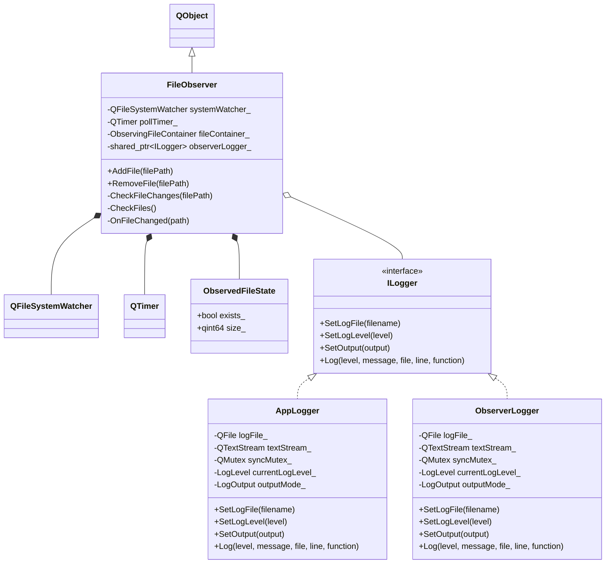
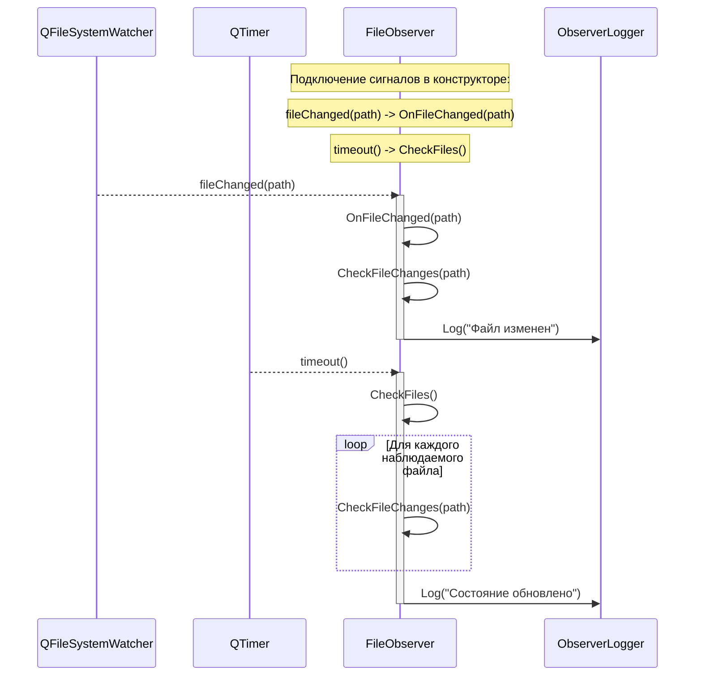

# Лабораторная работа по предмету: "Технологии программирования"
## Тема: "Наблюдение за файлами"
> 4 курс 2 семестр \
> Студент группы 932223 - Артеменко Антон Дмитриевич \

## Постановка задачи
Написать программу с консольным интерфейсом, которая выполняет слежение за выбранными файлами.

В рамках лабораторной работы отслеживаются две характеристики наблюдаемого файла:
- существование файла;
- размер файла.

Программа должна выводить в консоль уведомления при изменении состояния файла.

Для наблюдаемого файла рассматриваются следующие ситуации:
1. Файл существует и не пустой: выводится факт существования файла и его размер.
2. Файл существует и был изменен: выводится факт существования файла, сообщение об изменении и текущий размер.
3. Файл не существует: выводится сообщение об отсутствии файла.

При возникновении события изменения состояния наблюдаемого файла обработка выполняется через механизм сигнально-слотового взаимодействия Qt.

## Зависимости проекта
Проект использует следующие библиотеки и инструменты:
- **Qt** v5 с модулем `Core`
- **CMake** v3.16+

## Предлагаемое решение
Приложение реализовано как консольная программа на базе `QCoreApplication`.

Основные компоненты решения:
- **FileObserver** — класс, отвечающий за наблюдение за файлами. Хранит текущее состояние каждого отслеживаемого файла, проверяет факт существования и размер.
- **QFileSystemWatcher** — используется для получения событий изменения файловой системы.
- **QTimer** — выполняет периодическую проверку файлов, чтобы фиксировать удаление, повторное появление файла и изменение размера.
- **ILogger / AppLogger / ObserverLogger** — подсистема логирования для вывода сообщений приложения и событий наблюдения в консоль или файл.

### UML диаграмма классов



### Диаграмма сигнально-слотового взаимодействия



## Инструкция для пользователя
Сборка проекта выполняется следующим образом.

Необходимо создать директорию `build`:
```console
mkdir -p build && cd build
```

Сконфигурировать и собрать проект:
```console
cmake ..
cmake --build .
```

Для запуска введите в консоль:
```console
./file_observer_project [--log-output=console | --log-output=file]
```

После запуска программа предложит ввести пути к файлам для наблюдения. Ввод завершается пустой строкой.

Доступные команды интерактивной консоли:
- `add <path>` — добавить файл в список наблюдения;
- `remove <path>` — удалить файл из списка наблюдения;
- `list` — вывести список наблюдаемых файлов;
- `help` — показать список команд;
- `quit` — завершить работу программы.

Описание параметров запуска:
- `--log-output=console` — вывод логов в консоль;
- `--log-output=file` — вывод логов в файлы `logs/app.log` и `logs/observer.log`.

## Тестирование
Для проверки работы программы могут быть использованы следующие тестовые сценарии:

- **Test Case 1:** Запуск программы и добавление существующего непустого файла. Ожидается вывод сообщения о существовании файла и его размере.
- **Test Case 2:** Изменение содержимого наблюдаемого файла во время работы программы. Ожидается сообщение о том, что файл был изменен, и вывод нового размера.
- **Test Case 3:** Удаление наблюдаемого файла. Ожидается сообщение о том, что файл не существует.
- **Test Case 4:** Повторное создание ранее удаленного файла по тому же пути. Ожидается сообщение о появлении файла и его текущем размере.
- **Test Case 5:** Добавление пустого существующего файла. Ожидается сообщение о существовании пустого файла.
- **Test Case 6:** Запуск программы без добавления файлов на начальном этапе. Ожидается сообщение о том, что ни один файл пока не добавлен.
- **Test Case 7:** Добавление файла командой `add <path>` во время работы программы. Ожидается включение файла в мониторинг и вывод его состояния.
- **Test Case 8:** Удаление файла из мониторинга командой `remove <path>`. Ожидается прекращение уведомлений по данному файлу.
- **Test Case 9:** Ввод неизвестной команды в интерактивной консоли. Ожидается сообщение об ошибке и подсказка использовать команду `help`.
- **Test Case 10:** Запуск программы с параметром `--log-output=file`. Ожидается запись событий наблюдения в лог-файлы в директории `logs`.